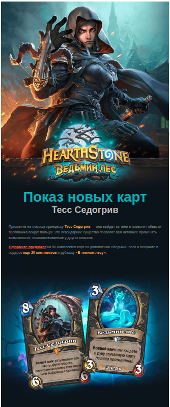

# HEART STONE EMAIL

Email created to refresh my HTML and CSS skills.

## Description
This project was made to revisit the basics of HTML and CSS layout.  
The email is dedicated to Heart Stone Email.

## Screenshots

## Technologies Used
- HTML
- CSS

## How to Run
Just open the `index.html` file in any modern web browser.

## Project Structure
- `index.html` — main page
- `images/` — images

## Project Goal
To practice web development fundamentals, layout structure, and repository setup.

---

